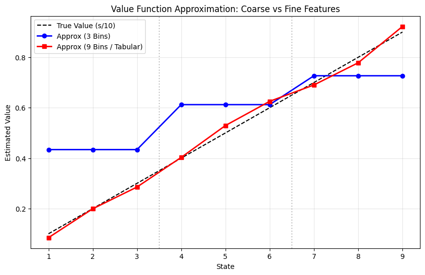
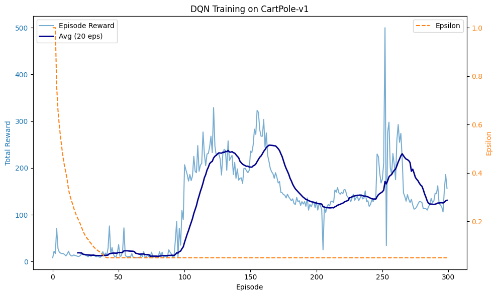
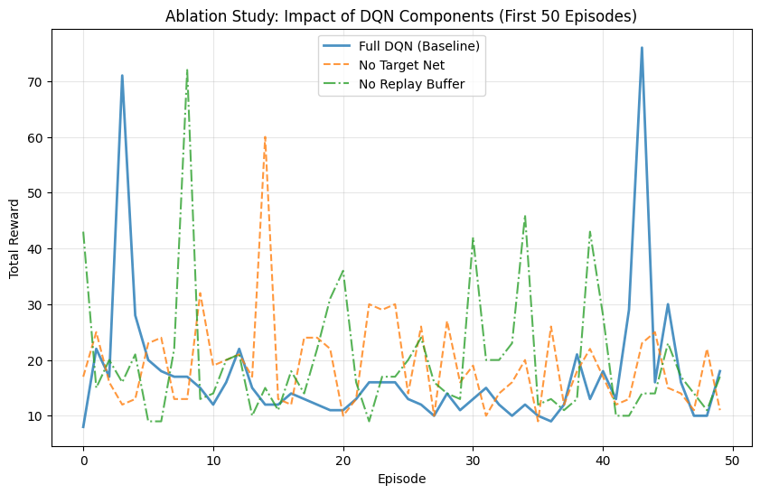

# Deep RL & Function Approximation: Linear TD(0) & DQN


[](LICENSE)

This repository transitions from tabular Reinforcement Learning to continuous state spaces using Function Approximation. It covers both linear value prediction and non-linear Deep Q-Networks (DQN).

## 📌 Project Overview

**Notebook**: [`function_approx_and_dqn.ipynb`](function_approx_and_dqn.ipynb)

The project is divided into two major components:

### 1. Linear Function Approximation (Value Prediction)
- **Environment**: Random Walk.
- **Method**: State aggregation (binning) combined with Linear TD(0).
- **Experiments**: Comparing generalization performance using different resolutions of state aggregation (e.g., 3 bins vs. 9 bins).

### 2. Deep Q-Network (DQN)
- **Environment**: `CartPole-v1` (OpenAI Gym).
- **Method**: A minimal implementation of DQN using PyTorch, incorporating Experience Replay and a Target Network.
- **Experiments**: Evaluating agent convergence and performing ablation studies on the effect of architectural/hyperparameter choices.

---

## 📊 Visualizations & Recorded Runs

The outputs show learned value estimates and reward curves from seeded runs. The CartPole experiment uses 300 episodes, while each ablation uses 50 episodes. These curves illustrate training behavior and are not multi-seed convergence estimates.

### Sample Outputs
<p align="center">
  
</p>
<p align="center">
  
  
</p>

---

## 🚀 Quickstart

```bash
git clone https://github.com/MSD-99/Function_Approximation_and_DQN_RL.git
cd Function_Approximation_and_DQN_RL
pip install -r requirements.txt
jupyter lab
```

Open `function_approx_and_dqn.ipynb` and run the cells in order. The environments are generated locally; no dataset or pretrained model is required.

## License

Released under the [MIT License](LICENSE).
